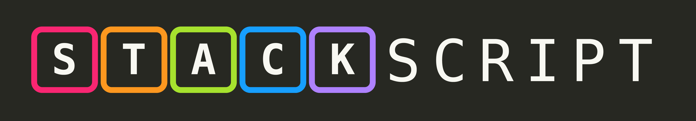

# StackScript
StackScript is a toy programming language, designed as a personal project to explore stack-based paradigm. This repository contains documentation about the language, a simple StackScript interpreter written in Python. While the language itself is not intended for real world use due to its limitations and inefficiency, it is a great learning tool and provides fun challenges when writing a program using it. 

Please note that this language and the provided interpreter are not intended for production use and should be treated purely as an educational and recreational tool. I cannot be held accountable for any mistakes it could lead to. 

This document is divided in multiple sections:
1. How to install and run StackScript programs
2. Core concepts
3. Instruction set
    1. I/O instructions
    2. Arithmetic instructions
    3. Jump Instructions
    4. Stack manipulation instructions
4. Code examples
5. How to contribute to the project

## How to install and run StackScript programs
Clone this repository locally using the command:  
`git clone https://github.com/brayevalerien/StackScript`

Once you have local version installed, run the [./src/stackscript.py](./src/stackscript.py) python script and pass the program file path in argument. For instance, if you want to run the [Fibonacci example](./examples/fibonacci.stsc), run the command: 
`python ./src/stackscript.py ./examples/fibonacci.stsc`

Note that python is required to run StackScript programs. 

## Core concepts
StackScript relies heavily on the concept of a stack. A stack is a data structure that is similar to a list, as it stores elements at memory addresses. However, a stack differs from a list in that it only allows the user to interact with the top element. This means that to operate on an element at the bottom of the stack, the user must first remove (pop) all elements above it. Similarly, elements can only be added to the top of the stack through a process called pushing. 
In StackScript, the stack can only store two types of elements:
- Floating-point numbers
- Tags, which are objects that point to instructions in the source code.
As a result, StackScript does not have native support for characters, strings, or more complex data structures like arrays. Moreover, there is not way to define variables of procedures/functions. 
A StackScript program consists of instructions, which can be separated from each other by spaces, tabs, and/or line breaks. These instructions are executed one by one by the interpreter, performing the corresponding operations. To get a better idea of how this works all together, see the examples sections.

## Instruction set
### I/O instructions
- there is no push instruction. Simply write the number or the tag you want to push on the stack (e.g. `1 2 tag show` will output `[1.0, 2.0, 'tag']`)
- `print`: prints the top of the stack to the standard output.
- `uInput`: reads a value from the standard input. Values that are not convertible to float are invalid.
- `show`: prints the whole stack to the standard output formatted as `[elem1, elem2, ... elemn]` where `elemn` is the top of the stack and `elem1` the bottom of the stack.

### Arithmetic instructions
In this section, we will note a the second-to-top element and b the top element of the stack.
- `add`: pops a and b and pushes a+b
- `sub`: pops a and b and pushes b-a
- `mul`: pops a and b and pushes a*b
- `div`: pops a and b and pushes b/a

### Jump instructions
Tags are a used by jump instructions. A jump instruction (conditional or not) requires a registered tag to be on top of the stack when it is executed, and will jump to the position in the source code where the tag was registered. Note that jump instructions pop the tag that are on top of the stack when executed.
- `>[tagName]`: registers a tag named `tagName`.
- `jump`: unconditionally jumps to the tag that is currently on top of the stack
- `jumpZero`: jumps to the tag that is currently on top of the stack iff the second-to-top element is 0.
- `jumpNotZero`: jumps to the tag that is currently on top of the stack iff the second-to-top element is not 0.

### Stack manipulation instructions
- `dup`: duplicates the top element and pushes it on the top of the stack (e.g. `1 dup show` will output `[1.0, 1.0]`).
- `drop`: pops the top element and discards it.
- `swap`: swaps the top two elements of the stack.
- `reach`: similar to `dup`, but it duplicates the second-to-top element.
- `cycle`: cycles the top three elements, bringing the one at the bottom on top.

## Code examples
All code examples are available at [./examples/](./examples/) for you to run them. Some of them are explained in this section.

## How to contribute to the project
